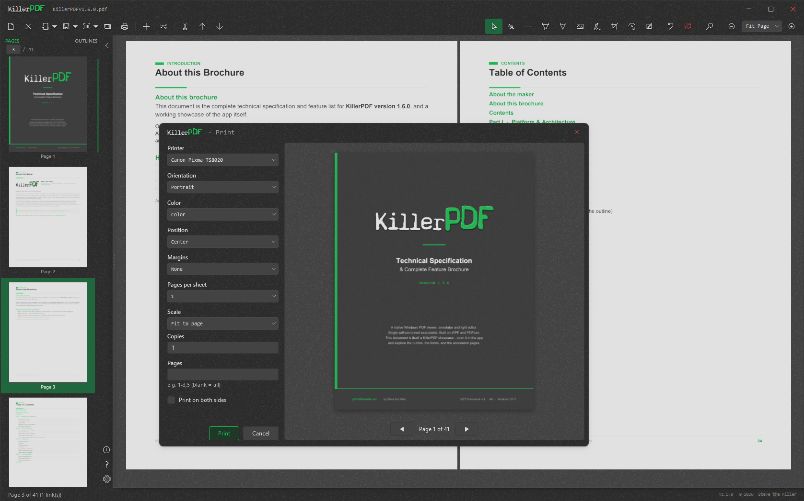
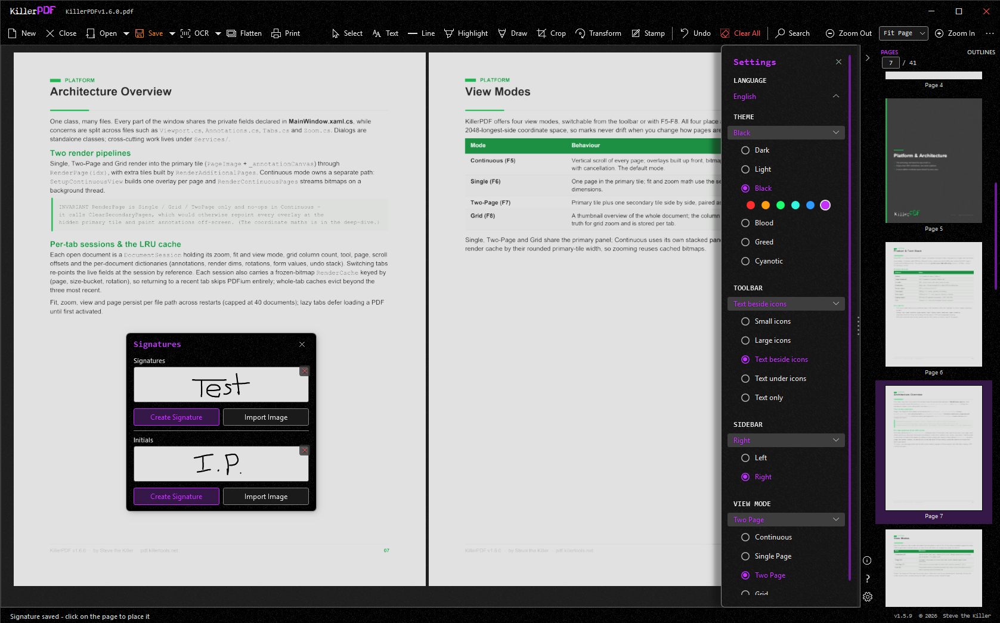
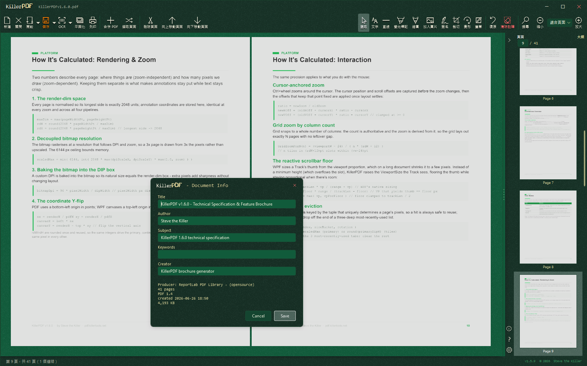
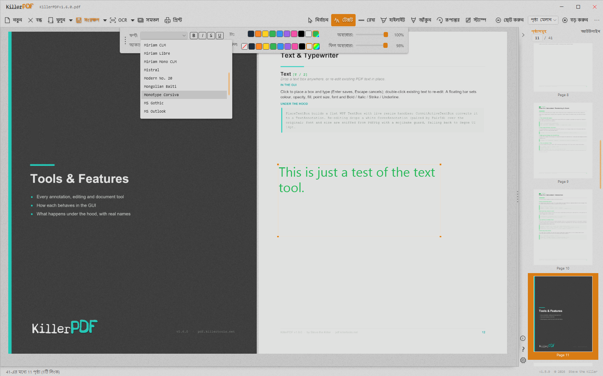
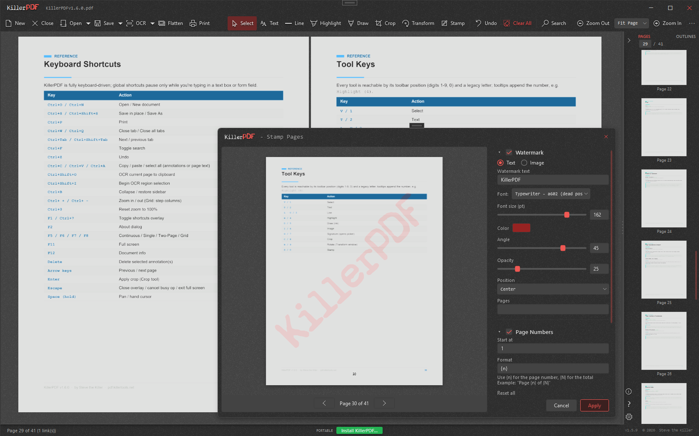
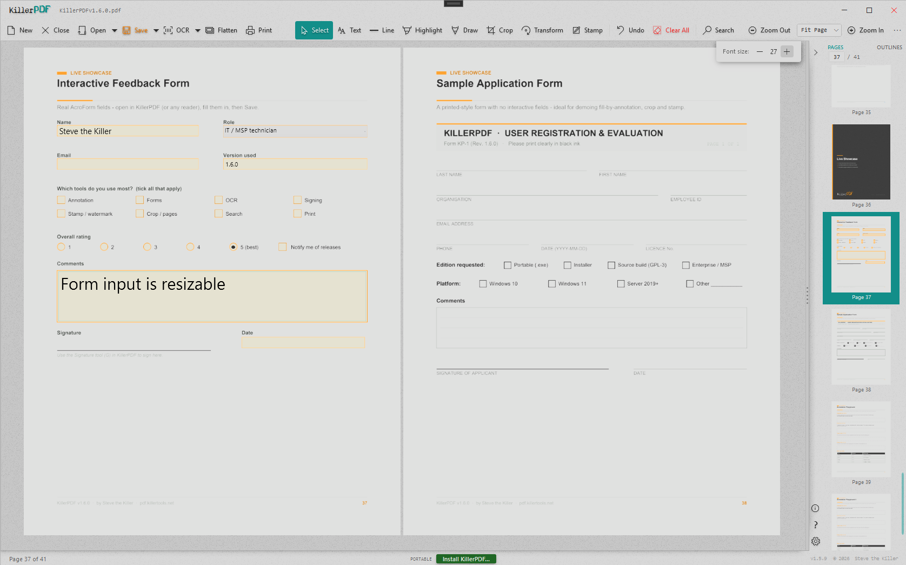

# KillerPDF

Free and open-source PDF editor for Windows. View, annotate, OCR, merge, split, edit text, draw, sign, fill forms, print, flatten, and open password-protected PDFs. Install or run portable as a single Windows EXE (about 15 MB; requires .NET Framework 4.8).

Original project: [SteveTheKiller/KillerPDF](https://github.com/SteveTheKiller/KillerPDF). Its website is [KillerPDF.net](https://killerpdf.net). This fork is maintained at [jensen0915/KillerPDF](https://github.com/jensen0915/KillerPDF).

## 本次微調版／About this refinement

**1.6.3-office-ux — 2026-10-03**

這是在原開源 KillerPDF 基礎上延續修改的一版，針對台灣辦公文件的閱讀、填寫、簽名與寄回情境做了後續微調。主要整理工具列與繁中用語，改善簽名操作，並修正中文表單及儲存／列印輸出的內容完整性。

本分支依舊遵循原專案的開源原則，沿用 **GNU GPLv3**，保留原作者、貢獻者的署名與授權資訊，並提供對應版本的原始碼及建置方式。這是衍生微調版，不是原專案的官方發佈，也不將原專案成果宣稱為重新原創。

This is a follow-up refinement of the original open-source KillerPDF, focused on everyday office documents and Traditional Chinese workflows in Taiwan. It reorganizes common actions, improves signature handling, and fixes Chinese form values and save/print output. This fork continues under **GNU GPLv3**, retains upstream attribution and license notices, and provides corresponding source and build instructions. It is a modified fork, not an official upstream release.

- Task groups for reading, filling/signing, annotations, and page organization; visible file commands and unsaved-state text.
- Taiwanese terminology, Gregorian/ROC dates, check marks, multiline text, and Ctrl+Enter to finish editing. Esc cancels tools or panels.
- Native WPF signature ink, undo-last-stroke, and optional local signature storage, unchecked by default.
- Unicode AcroForm values and widget appearances; shared output snapshots and safe file replacement prevent missing content and repeated annotation burn-in.
- **File → Export compatible PDF copy** / **檔案 → 匯出相容 PDF 副本** creates an image-based copy. Its text is not selectable, and its form fields are no longer editable; the working document stays open with its current unsaved state.

[繁中操作說明](OFFICE_UX.md) · [驗證結果與待驗項目](OFFICE_UX_VALIDATION.md) · [GitHub 發佈方式與目前狀態](PROJECT_STATUS.md)

As of this documentation update, the refinement has been packaged locally; this work has not published a GitHub Release. The validation report distinguishes automated checks from pending physical-stylus, IME, printer, and Edge/Adobe Reader checks.

## Original project motivation

The following motivation is retained from the upstream README:

I hate Adobe. Acrobat is bloated, wants a subscription to do basic things, and phones home constantly. Most of the "free" alternatives are either ad-riddled, cloud-based, or rebrands of the same PDF engine sold under three different names.

KillerPDF is what I wanted: local-only, portable, no account, no telemetry. The PDF equivalent of Notepad.

## Features

### Viewing & navigation

- High-quality rendering via PDFium
- Four view modes - Single Page, Continuous scroll, Two-Page, and Grid - that persist across sessions
- Tabbed documents: open several PDFs at once, each restoring its page, zoom, and view mode
- Full-text search across the whole document with highlighting; drag-select to copy text
- Outline/bookmark navigation and clickable links, including internal cross-references and TOC back-links
- Zoom presets with scroll-wheel sync; Fit to Width and Fit Page re-apply on resize
- Full-screen mode (F11) hides all chrome so only the document fills the screen
- Recent files on the start screen and Open menu, each with its real Windows file-type icon

### Annotate & edit

- Inline text editing with font matching against the original document
- Resizable, word-wrapping text boxes with an optional whiteout background fill
- Freehand draw, a straight-line tool, and highlight - each with its own color, opacity, and width
- Full RGB color picker: saturation/value square, hue strip, hex input, screen eyedropper, and editable palette
- Select tool to move, resize, multi-select, and restyle any annotation in place
- Insert images as resizable annotations, burned into the PDF on save
- Page-number and watermark stamping across a page range, applied as one undo

### OCR (built in, no cloud)

- OCR a whole page or a dragged region straight to the clipboard
- Make Searchable PDF: lay an invisible text layer over a scan
- Extract All Text to a `.txt` or `.md` file
- Tesseract bundled in the single EXE; extra languages download on demand

### Organize pages

- Merge multiple PDFs and split out selected pages, with drag-and-drop reordering
- Right-click sidebar: insert blank page, rotate, move, extract, or delete - on multi-page selections
- Crop with corner handles; remove crop from one page or all
- Transform: rotate by 90 degrees or a fine angle, scale, flip, and straighten a crooked scan by drawing a level line - live preview, with annotations following the transform
- Drop a folder or `.zip` onto the window to merge the PDFs and images inside into one, or open each separately

### Forms & signing

- Fill PDF forms (text, checkbox, radio) as live controls and save back to the PDF
- Digital signatures with a cloud certificate (Certum SimplySign), including click-to-sign form fields
- Draw and reuse signatures and initials, or import a PNG/JPG/BMP to place anywhere

### Output

- Print with annotations flattened, a real in-app preview, and scale / position / margins / pages-per-sheet / color / two-sided options, rendered at 300 DPI
- Export compatible PDF copy: rasterize every page into an image-based copy for viewers that have trouble with the original PDF; text selection and editable form fields are not retained
- Document Info: view and edit title, author, subject, keywords, and creator metadata

### Customize

- Six themes - Dark, Light, Black, Blood, Greed, Cyanotic - with per-theme accent colors, switchable live
- Office task toolbar with a keyboard-accessible More menu, plus a resizable sidebar that docks left or right
- Localized UI in 8 languages (English, Spanish, Traditional and Simplified Chinese, German, French, Turkish, Bengali); contribute via `Strings/TRANSLATING.md`
- Full keyboard shortcut overlay (Ctrl+?) with a link to the online guide

### App & files

- Single portable Windows EXE, about 15 MB; uses .NET Framework 4.8
- Self-installs per-user to %LOCALAPPDATA% (no UAC), registers as a PDF handler with a branded file icon, and uninstalls cleanly via Add/Remove Programs
- Opens password-protected PDFs (prompts instead of erroring) and repairs damaged ones
- Preserves editable text for normal PDFs, while warning when Edge/Adobe-compatible flattened output is safer
- Document editing runs locally; optional OCR language downloads, update checks, and certificate signing may use network services

## Screenshots

These screenshots are retained from the upstream interface and do not show the new office task toolbar. See the [usage guide](OFFICE_UX.md) for the current workflow.

<p align="center">
  
  
  
  
  
  
</p>

## Requirements

- Windows 10 or 11 (x64)
- .NET Framework 4.8. The .NET 8 SDK is needed for building from source, not for running the EXE.

## Download and updates

- This fork: [jensen0915/KillerPDF Releases](https://github.com/jensen0915/KillerPDF/releases). Use the assets from the matching release when available; the link does not imply that `1.6.3-office-ux` has already been published.
- Current local refinement: `bin/OfficeUX/KillerPDF.exe`, alongside `KillerPDF-1.6.3-office-ux-src.zip`, `LICENSE`, `PDFium-LICENSE.txt`, and `SHA256SUMS.txt`.
- Original project: [upstream releases](https://github.com/SteveTheKiller/KillerPDF/releases). WinGet and Chocolatey commands below install the upstream distribution, not this fork's office refinement.

Upstream WinGet:

```powershell
winget install killerpdf
```

Upstream Chocolatey:

```powershell
choco install killerpdf
```

The app's built-in update check and some issue-report links still target upstream. Use this fork's release page to obtain its refinements, and report fork-specific problems in [this fork's Issues](https://github.com/jensen0915/KillerPDF/issues).

## Build from source

```powershell
git clone https://github.com/jensen0915/KillerPDF.git
cd KillerPDF
dotnet publish KillerPDF.csproj -c Release -o bin/OfficeUX
```

This command writes to `bin/OfficeUX/`. The GitHub workflow uses `Properties/PublishProfiles/FolderProfile1.pubxml` and writes to `bin/Release/net48/publish/`. Both publish paths produce a Costura-bundled `KillerPDF.exe` and a versioned `KillerPDF-<version>-src.zip` containing the source and build files. Keep the matching source archive and [LICENSE](LICENSE) available with distributed builds.

Requires the .NET 8 SDK or later to build (even though the output targets .NET Framework 4.8).

## Changelog

See [CHANGELOG.md](CHANGELOG.md).

## License

This fork and its refinements continue under **GNU GPLv3**. The original [LICENSE](LICENSE) text and upstream attribution are retained. The source archive includes this version's modifications and build files. The local package and release workflow also preserve PDFium's bundled third-party notices as `PDFium-LICENSE.txt`; dependency licenses remain applicable.

本微調版延續 GNU GPLv3 開源授權，保留原有署名與授權文件，並提供包含本次修改的原始碼及建置方式。完整授權條款請見 [LICENSE](LICENSE)。感謝原專案作者及所有貢獻者。
